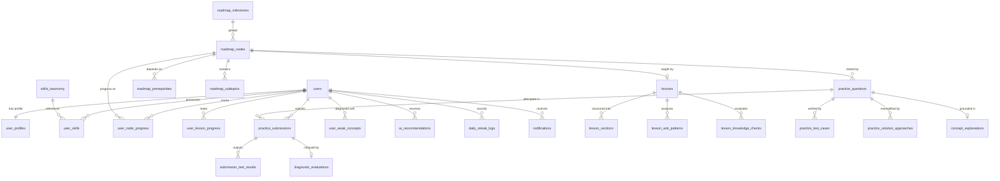

# CogniPath AI — Comprehensive Database Schema Specification

> **Target Audience**: AI Agents, Backend Developers, Database Administrators, and Cloud Architects.  
> **Supported Engines**: PostgreSQL 15+ (Relational with JSONB/pgvector) & Firestore/Document-Store Projections.  
> **Document Purpose**: Complete relational entity modeling, table definitions, foreign key constraints, indexes, triggers, seed definitions, and migration blueprints.

---

## 1. Entity Relationship Overview



---

## 2. Core Relational Schema (PostgreSQL DDL)

### 2.1 Enumerations & Extensions
```sql
-- Extensions
CREATE EXTENSION IF NOT EXISTS "uuid-ossp";
CREATE EXTENSION IF NOT EXISTS "pgcrypto";

-- Enums
CREATE TYPE user_role_enum AS ENUM ('student', 'mentor', 'admin');
CREATE TYPE user_status_enum AS ENUM ('active', 'suspended', 'pending_verification');
CREATE TYPE theme_enum AS ENUM ('light', 'dark', 'system');
CREATE TYPE experience_level_enum AS ENUM ('Complete Beginner', 'Beginner', 'Intermediate', 'Advanced');
CREATE TYPE difficulty_level_enum AS ENUM ('Beginner', 'Intermediate', 'Advanced');
CREATE TYPE node_status_enum AS ENUM ('locked', 'available', 'in_progress', 'completed', 'review_needed');
CREATE TYPE question_type_enum AS ENUM ('concept', 'mcq', 'output_prediction', 'coding', 'debugging', 'scenario');
CREATE TYPE code_language_enum AS ENUM ('javascript', 'typescript', 'python', 'go');
CREATE TYPE recommendation_impact_enum AS ENUM ('Critical', 'High', 'Medium', 'Elective');
CREATE TYPE notification_type_enum AS ENUM ('practice', 'roadmap', 'weakness', 'recommendation', 'streak');
```

---

### 2.2 User Identity & Profile

#### `users` Table
Primary identity record for authentication and credentials.
```sql
CREATE TABLE users (
    id UUID PRIMARY KEY DEFAULT uuid_generate_v4(),
    email VARCHAR(255) NOT NULL UNIQUE,
    password_hash VARCHAR(255) NOT NULL,
    name VARCHAR(100) NOT NULL,
    avatar_url TEXT DEFAULT NULL,
    role user_role_enum NOT NULL DEFAULT 'student',
    status user_status_enum NOT NULL DEFAULT 'active',
    created_at TIMESTAMPTZ NOT NULL DEFAULT NOW(),
    updated_at TIMESTAMPTZ NOT NULL DEFAULT NOW()
);

CREATE INDEX idx_users_email ON users(email);
```

#### `user_profiles` Table
Pedagogical calibration, progress metrics, and telemetry settings.
```sql
CREATE TABLE user_profiles (
    user_id UUID PRIMARY KEY REFERENCES users(id) ON DELETE CASCADE,
    target_goal VARCHAR(120) NOT NULL DEFAULT 'Full Stack Developer',
    custom_goal VARCHAR(255) DEFAULT NULL,
    experience_level experience_level_enum NOT NULL DEFAULT 'Intermediate',
    daily_commitment_minutes INT NOT NULL DEFAULT 30 CHECK (daily_commitment_minutes >= 5 AND daily_commitment_minutes <= 240),
    learning_reason TEXT DEFAULT NULL,
    learning_preferences JSONB DEFAULT '["code-first", "theoretical-monographs"]'::jsonb,
    streak_days INT NOT NULL DEFAULT 0 CHECK (streak_days >= 0),
    xp INT NOT NULL DEFAULT 0 CHECK (xp >= 0),
    overall_mastery INT NOT NULL DEFAULT 0 CHECK (overall_mastery >= 0 AND overall_mastery <= 100),
    completed_questions_today INT NOT NULL DEFAULT 0 CHECK (completed_questions_today >= 0),
    total_questions_target_today INT NOT NULL DEFAULT 5 CHECK (total_questions_target_today >= 1),
    current_topic_id VARCHAR(64) DEFAULT 'js-event-loop',
    theme theme_enum NOT NULL DEFAULT 'light',
    last_active_at TIMESTAMPTZ NOT NULL DEFAULT NOW(),
    updated_at TIMESTAMPTZ NOT NULL DEFAULT NOW()
);

CREATE INDEX idx_user_profiles_goal ON user_profiles(target_goal);
CREATE INDEX idx_user_profiles_mastery ON user_profiles(overall_mastery);
```

#### `skills_taxonomy` & `user_skills` Tables
Competencies directory and user skill ratings.
```sql
CREATE TABLE skills_taxonomy (
    id VARCHAR(64) PRIMARY KEY,
    name VARCHAR(100) NOT NULL,
    category VARCHAR(50) NOT NULL,
    difficulty difficulty_level_enum NOT NULL,
    prerequisites JSONB DEFAULT '[]'::jsonb,
    related_skills JSONB DEFAULT '[]'::jsonb,
    est_hours INT NOT NULL DEFAULT 10,
    career_relevance TEXT NOT NULL,
    description TEXT NOT NULL,
    trending BOOLEAN NOT NULL DEFAULT FALSE,
    created_at TIMESTAMPTZ NOT NULL DEFAULT NOW()
);

CREATE TABLE user_skills (
    id UUID PRIMARY KEY DEFAULT uuid_generate_v4(),
    user_id UUID NOT NULL REFERENCES users(id) ON DELETE CASCADE,
    skill_id VARCHAR(64) NOT NULL REFERENCES skills_taxonomy(id) ON DELETE CASCADE,
    level experience_level_enum NOT NULL DEFAULT 'Beginner',
    updated_at TIMESTAMPTZ NOT NULL DEFAULT NOW(),
    UNIQUE(user_id, skill_id)
);

CREATE INDEX idx_user_skills_user ON user_skills(user_id);
```

---

### 2.3 Curriculum Roadmap & Topological Dependencies

#### `roadmap_milestones` Table
Sequential curriculum milestones.
```sql
CREATE TABLE roadmap_milestones (
    id VARCHAR(64) PRIMARY KEY,
    title VARCHAR(150) NOT NULL,
    description TEXT NOT NULL,
    sequence_order INT NOT NULL,
    target_goal VARCHAR(120) NOT NULL
);

CREATE INDEX idx_milestones_goal_order ON roadmap_milestones(target_goal, sequence_order);
```

#### `roadmap_nodes` Table
Individual topic competencies forming the topological curriculum graph.
```sql
CREATE TABLE roadmap_nodes (
    id VARCHAR(64) PRIMARY KEY,
    milestone_id VARCHAR(64) NOT NULL REFERENCES roadmap_milestones(id) ON DELETE CASCADE,
    title VARCHAR(150) NOT NULL,
    category VARCHAR(50) NOT NULL,
    category_label VARCHAR(80) NOT NULL,
    difficulty difficulty_level_enum NOT NULL,
    est_minutes INT NOT NULL DEFAULT 45,
    why_it_matters TEXT NOT NULL,
    description TEXT NOT NULL,
    sequence_order INT NOT NULL,
    created_at TIMESTAMPTZ NOT NULL DEFAULT NOW()
);

CREATE INDEX idx_roadmap_nodes_milestone ON roadmap_nodes(milestone_id, sequence_order);
CREATE INDEX idx_roadmap_nodes_category ON roadmap_nodes(category);
```

#### `roadmap_prerequisites` Table
Directed acyclic graph (DAG) dependency edges.
```sql
CREATE TABLE roadmap_prerequisites (
    node_id VARCHAR(64) NOT NULL REFERENCES roadmap_nodes(id) ON DELETE CASCADE,
    prerequisite_node_id VARCHAR(64) NOT NULL REFERENCES roadmap_nodes(id) ON DELETE CASCADE,
    PRIMARY KEY (node_id, prerequisite_node_id)
);

CREATE INDEX idx_prereq_target ON roadmap_prerequisites(node_id);
CREATE INDEX idx_prereq_dependency ON roadmap_prerequisites(prerequisite_node_id);
```

#### `roadmap_subtopics` & `user_node_progress`
Checklist sub-competencies and individual student progression.
```sql
CREATE TABLE roadmap_subtopics (
    id VARCHAR(64) PRIMARY KEY,
    node_id VARCHAR(64) NOT NULL REFERENCES roadmap_nodes(id) ON DELETE CASCADE,
    title VARCHAR(150) NOT NULL,
    sequence_order INT NOT NULL DEFAULT 0
);

CREATE TABLE user_node_progress (
    id UUID PRIMARY KEY DEFAULT uuid_generate_v4(),
    user_id UUID NOT NULL REFERENCES users(id) ON DELETE CASCADE,
    node_id VARCHAR(64) NOT NULL REFERENCES roadmap_nodes(id) ON DELETE CASCADE,
    status node_status_enum NOT NULL DEFAULT 'locked',
    mastery_percent INT NOT NULL DEFAULT 0 CHECK (mastery_percent >= 0 AND mastery_percent <= 100),
    started_at TIMESTAMPTZ DEFAULT NULL,
    completed_at TIMESTAMPTZ DEFAULT NULL,
    review_flagged_at TIMESTAMPTZ DEFAULT NULL,
    updated_at TIMESTAMPTZ NOT NULL DEFAULT NOW(),
    UNIQUE(user_id, node_id)
);

CREATE INDEX idx_user_node_progress ON user_node_progress(user_id, status);
```

---

### 2.4 Pedagogical Monograph Lessons

#### `lessons` & `lesson_sections` Tables
Deep technical monographs and structured subsections.
```sql
CREATE TABLE lessons (
    id VARCHAR(64) PRIMARY KEY,
    topic_id VARCHAR(64) NOT NULL UNIQUE REFERENCES roadmap_nodes(id) ON DELETE CASCADE,
    title VARCHAR(200) NOT NULL,
    subtitle TEXT NOT NULL,
    estimated_minutes INT NOT NULL DEFAULT 30,
    difficulty difficulty_level_enum NOT NULL,
    mastery_level INT NOT NULL DEFAULT 0,
    why_you_are_learning_this TEXT NOT NULL,
    key_takeaways JSONB NOT NULL DEFAULT '[]'::jsonb,
    created_at TIMESTAMPTZ NOT NULL DEFAULT NOW(),
    updated_at TIMESTAMPTZ NOT NULL DEFAULT NOW()
);

CREATE TABLE lesson_sections (
    id VARCHAR(64) PRIMARY KEY,
    lesson_id VARCHAR(64) NOT NULL REFERENCES lessons(id) ON DELETE CASCADE,
    title VARCHAR(150) NOT NULL,
    content TEXT NOT NULL,
    code_snippet JSONB DEFAULT NULL, -- { language: string, code: string, caption: string }
    highlight_note TEXT DEFAULT NULL,
    callout_type VARCHAR(20) DEFAULT NULL, -- 'info', 'warning', 'tip'
    sequence_order INT NOT NULL DEFAULT 0
);

CREATE INDEX idx_lesson_sections ON lesson_sections(lesson_id, sequence_order);
```

#### `lesson_anti_patterns` & `lesson_knowledge_checks`
Diagnostic common misconceptions and formative quizzes.
```sql
CREATE TABLE lesson_anti_patterns (
    id UUID PRIMARY KEY DEFAULT uuid_generate_v4(),
    lesson_id VARCHAR(64) NOT NULL REFERENCES lessons(id) ON DELETE CASCADE,
    title VARCHAR(150) NOT NULL,
    mistake_code TEXT NOT NULL,
    correction_code TEXT NOT NULL,
    explanation TEXT NOT NULL,
    sequence_order INT NOT NULL DEFAULT 0
);

CREATE TABLE lesson_knowledge_checks (
    id VARCHAR(64) PRIMARY KEY,
    lesson_id VARCHAR(64) NOT NULL REFERENCES lessons(id) ON DELETE CASCADE,
    question TEXT NOT NULL,
    options JSONB NOT NULL, -- array of 4 string options
    correct_index INT NOT NULL CHECK (correct_index >= 0 AND correct_index <= 3),
    explanation TEXT NOT NULL,
    sequence_order INT NOT NULL DEFAULT 0
);
```

---

### 2.5 Practice Problems, Sandboxing & AI Evaluations

#### `practice_questions` Table
Multi-typology exercises with problem specifications.
```sql
CREATE TABLE practice_questions (
    id VARCHAR(64) PRIMARY KEY,
    topic_id VARCHAR(64) NOT NULL REFERENCES roadmap_nodes(id) ON DELETE CASCADE,
    type question_type_enum NOT NULL DEFAULT 'coding',
    type_label VARCHAR(60) NOT NULL,
    title VARCHAR(180) NOT NULL,
    difficulty difficulty_level_enum NOT NULL,
    est_minutes INT NOT NULL DEFAULT 15,
    why_this_matters TEXT NOT NULL,
    prompt TEXT NOT NULL,
    code_snippet TEXT DEFAULT NULL,
    options JSONB DEFAULT NULL, -- [{ id: "opt-1", label: "...", code: "..." }]
    correct_answer TEXT DEFAULT NULL,
    explanation TEXT DEFAULT NULL,
    starter_code TEXT DEFAULT NULL,
    language code_language_enum DEFAULT 'javascript',
    sequence_order INT NOT NULL DEFAULT 0,
    created_at TIMESTAMPTZ NOT NULL DEFAULT NOW()
);

CREATE INDEX idx_practice_questions_topic ON practice_questions(topic_id, sequence_order);
CREATE INDEX idx_practice_questions_type ON practice_questions(type);
```

#### `practice_test_cases` Table
Sandboxed unit test invariants.
```sql
CREATE TABLE practice_test_cases (
    id VARCHAR(64) PRIMARY KEY,
    question_id VARCHAR(64) NOT NULL REFERENCES practice_questions(id) ON DELETE CASCADE,
    input TEXT NOT NULL,
    expected_output TEXT NOT NULL,
    is_hidden BOOLEAN NOT NULL DEFAULT FALSE,
    sequence_order INT NOT NULL DEFAULT 0
);

CREATE INDEX idx_test_cases_question ON practice_test_cases(question_id, sequence_order);
```

#### `practice_solution_approaches` Table
Exemplary solutions (baseline, idiomatic, high-performance).
```sql
CREATE TABLE practice_solution_approaches (
    id VARCHAR(64) PRIMARY KEY,
    question_id VARCHAR(64) NOT NULL REFERENCES practice_questions(id) ON DELETE CASCADE,
    rank INT NOT NULL DEFAULT 1,
    title VARCHAR(120) NOT NULL,
    subtitle VARCHAR(180) NOT NULL,
    paradigm VARCHAR(80) NOT NULL,
    time_complexity VARCHAR(30) NOT NULL,
    space_complexity VARCHAR(30) NOT NULL,
    code TEXT NOT NULL,
    language VARCHAR(30) DEFAULT 'javascript',
    explanation TEXT NOT NULL,
    pros JSONB NOT NULL DEFAULT '[]'::jsonb,
    cons JSONB NOT NULL DEFAULT '[]'::jsonb,
    when_to_use TEXT NOT NULL
);

CREATE INDEX idx_solutions_question ON practice_solution_approaches(question_id, rank);
```

#### `concept_explanations` Table
Theoretical specifications and underlying mechanics.
```sql
CREATE TABLE concept_explanations (
    id VARCHAR(64) PRIMARY KEY,
    question_id VARCHAR(64) NOT NULL UNIQUE REFERENCES practice_questions(id) ON DELETE CASCADE,
    topic VARCHAR(120) NOT NULL,
    theoretical_foundation TEXT NOT NULL,
    underlying_mechanics TEXT NOT NULL,
    step_by_step_trace JSONB NOT NULL DEFAULT '[]'::jsonb,
    architectural_takeaways TEXT NOT NULL,
    common_pitfalls JSONB NOT NULL DEFAULT '[]'::jsonb
);
```

#### `practice_submissions` & `diagnostic_evaluations`
User code submissions, sandbox execution metrics, and AI evaluation output.
```sql
CREATE TABLE practice_submissions (
    id UUID PRIMARY KEY DEFAULT uuid_generate_v4(),
    user_id UUID NOT NULL REFERENCES users(id) ON DELETE CASCADE,
    question_id VARCHAR(64) NOT NULL REFERENCES practice_questions(id) ON DELETE CASCADE,
    language code_language_enum NOT NULL DEFAULT 'javascript',
    submitted_code TEXT DEFAULT NULL,
    selected_answer TEXT DEFAULT NULL,
    is_passed BOOLEAN NOT NULL DEFAULT FALSE,
    score INT NOT NULL DEFAULT 0 CHECK (score >= 0 AND score <= 100),
    runtime_ms INT NOT NULL DEFAULT 0,
    memory_mb NUMERIC(6,2) NOT NULL DEFAULT 0.0,
    time_complexity VARCHAR(30) DEFAULT NULL,
    space_complexity VARCHAR(30) DEFAULT NULL,
    passed_tests INT NOT NULL DEFAULT 0,
    total_tests INT NOT NULL DEFAULT 0,
    summary TEXT DEFAULT NULL,
    submitted_at TIMESTAMPTZ NOT NULL DEFAULT NOW()
);

CREATE INDEX idx_submissions_user_question ON practice_submissions(user_id, question_id, submitted_at DESC);

CREATE TABLE diagnostic_evaluations (
    submission_id UUID PRIMARY KEY REFERENCES practice_submissions(id) ON DELETE CASCADE,
    what_you_did_well JSONB NOT NULL DEFAULT '[]'::jsonb,
    what_could_be_improved JSONB NOT NULL DEFAULT '[]'::jsonb,
    concepts_demonstrated JSONB NOT NULL DEFAULT '[]'::jsonb, -- [{ name: string, status: string }]
    alternative_approach TEXT DEFAULT NULL,
    ai_recommendation TEXT NOT NULL,
    failing_test_details JSONB DEFAULT NULL,
    created_at TIMESTAMPTZ NOT NULL DEFAULT NOW()
);
```

---

### 2.6 Diagnostics, Interventions, Streaks & Notifications

#### `user_weak_concepts` Table
Persisted weak concepts flagged for remediation.
```sql
CREATE TABLE user_weak_concepts (
    id UUID PRIMARY KEY DEFAULT uuid_generate_v4(),
    user_id UUID NOT NULL REFERENCES users(id) ON DELETE CASCADE,
    topic_id VARCHAR(64) NOT NULL REFERENCES roadmap_nodes(id) ON DELETE CASCADE,
    name VARCHAR(150) NOT NULL,
    category VARCHAR(80) NOT NULL,
    mastery_percent INT NOT NULL DEFAULT 0 CHECK (mastery_percent >= 0 AND mastery_percent <= 100),
    failure_count INT NOT NULL DEFAULT 1,
    reason TEXT NOT NULL,
    recommended_action TEXT NOT NULL,
    resolved BOOLEAN NOT NULL DEFAULT FALSE,
    created_at TIMESTAMPTZ NOT NULL DEFAULT NOW(),
    updated_at TIMESTAMPTZ NOT NULL DEFAULT NOW()
);

CREATE INDEX idx_weak_concepts_user ON user_weak_concepts(user_id, resolved);
```

#### `ai_recommendations` Table
Personalized learning interventions synthesized by the engine.
```sql
CREATE TABLE ai_recommendations (
    id VARCHAR(64) PRIMARY KEY,
    user_id UUID NOT NULL REFERENCES users(id) ON DELETE CASCADE,
    title VARCHAR(180) NOT NULL,
    category VARCHAR(60) NOT NULL,
    why_recommendation TEXT NOT NULL,
    expected_impact recommendation_impact_enum NOT NULL DEFAULT 'High',
    est_hours NUMERIC(4,1) NOT NULL DEFAULT 2.0,
    action_topic_id VARCHAR(64) NOT NULL REFERENCES roadmap_nodes(id) ON DELETE CASCADE,
    status VARCHAR(30) NOT NULL DEFAULT 'pending', -- 'pending', 'accepted', 'dismissed'
    created_at TIMESTAMPTZ NOT NULL DEFAULT NOW()
);

CREATE INDEX idx_recommendations_user ON ai_recommendations(user_id, status);
```

#### `daily_streak_logs` & `notifications` Tables
Streak consistency matrix and actionable notifications.
```sql
CREATE TABLE daily_streak_logs (
    id UUID PRIMARY KEY DEFAULT uuid_generate_v4(),
    user_id UUID NOT NULL REFERENCES users(id) ON DELETE CASCADE,
    activity_date DATE NOT NULL,
    questions_completed INT NOT NULL DEFAULT 0,
    minutes_spent INT NOT NULL DEFAULT 0,
    xp_earned INT NOT NULL DEFAULT 0,
    UNIQUE(user_id, activity_date)
);

CREATE INDEX idx_streak_user_date ON daily_streak_logs(user_id, activity_date DESC);

CREATE TABLE notifications (
    id UUID PRIMARY KEY DEFAULT uuid_generate_v4(),
    user_id UUID NOT NULL REFERENCES users(id) ON DELETE CASCADE,
    type notification_type_enum NOT NULL DEFAULT 'practice',
    title VARCHAR(150) NOT NULL,
    message TEXT NOT NULL,
    read BOOLEAN NOT NULL DEFAULT FALSE,
    action_view VARCHAR(40) DEFAULT NULL,
    target_id VARCHAR(64) DEFAULT NULL,
    created_at TIMESTAMPTZ NOT NULL DEFAULT NOW()
);

CREATE INDEX idx_notifications_user ON notifications(user_id, read, created_at DESC);
```

---

## 3. Database Triggers & Automated Telemetry Updaters

### 3.1 Automatic Streak & XP Update on Submission
When a practice submission passes, update the user profile XP and daily streak log:
```sql
CREATE OR REPLACE FUNCTION update_user_streak_and_xp()
RETURNS TRIGGER AS $$
BEGIN
    IF NEW.is_passed = TRUE THEN
        -- Insert or update daily streak log
        INSERT INTO daily_streak_logs (user_id, activity_date, questions_completed, xp_earned)
        VALUES (NEW.user_id, CURRENT_DATE, 1, 50)
        ON CONFLICT (user_id, activity_date) DO UPDATE
        SET questions_completed = daily_streak_logs.questions_completed + 1,
            xp_earned = daily_streak_logs.xp_earned + 50;

        -- Update user_profiles counters
        UPDATE user_profiles
        SET xp = xp + 50,
            completed_questions_today = completed_questions_today + 1,
            last_active_at = NOW()
        WHERE user_id = NEW.user_id;
    END IF;
    RETURN NEW;
END;
$$ LANGUAGE plpgsql;

CREATE TRIGGER trg_after_submission_xp
AFTER INSERT ON practice_submissions
FOR EACH ROW
EXECUTE FUNCTION update_user_streak_and_xp();
```

---

## 4. NoSQL / Cloud Firestore Document Projection

For implementations utilizing Cloud Firestore or document stores, the relational structure maps cleanly into hierarchical sub-collections:

```
users/{userId}
  ├── profile (document)
  ├── skills/{skillId}
  ├── nodeProgress/{nodeId}
  ├── submissions/{submissionId}
  │     └── diagnostic (nested map)
  ├── weakConcepts/{conceptId}
  ├── recommendations/{recId}
  └── streakLogs/{date}

curriculum/
  ├── milestones/{milestoneId}
  ├── nodes/{nodeId}
  │     ├── prerequisites (array)
  │     └── subtopics (subcollection)
  ├── lessons/{topicId}
  │     ├── sections (array)
  │     ├── antiPatterns (array)
  │     └── knowledgeCheck (array)
  └── questions/{questionId}
        ├── testCases (subcollection)
        ├── topSolutions (array)
        └── conceptExplanation (nested map)
```

---

## 5. Security Policies & Row-Level Security (RLS)

PostgreSQL Row Level Security ensures strict tenant isolation across all user-owned data:

```sql
-- Enable RLS on all user data tables
ALTER TABLE user_profiles ENABLE ROW LEVEL SECURITY;
ALTER TABLE user_skills ENABLE ROW LEVEL SECURITY;
ALTER TABLE user_node_progress ENABLE ROW LEVEL SECURITY;
ALTER TABLE practice_submissions ENABLE ROW LEVEL SECURITY;
ALTER TABLE user_weak_concepts ENABLE ROW LEVEL SECURITY;
ALTER TABLE notifications ENABLE ROW LEVEL SECURITY;

-- Sample policy: Users can only read and modify their own records
CREATE POLICY user_profiles_isolation_policy ON user_profiles
    FOR ALL
    USING (user_id = current_setting('app.current_user_id')::uuid);

CREATE POLICY practice_submissions_isolation_policy ON practice_submissions
    FOR ALL
    USING (user_id = current_setting('app.current_user_id')::uuid);
```
